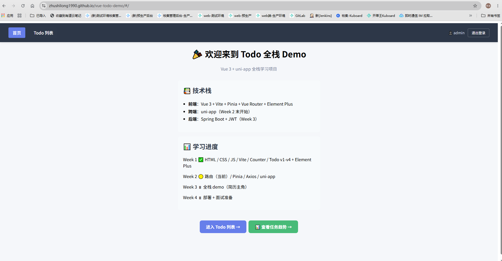
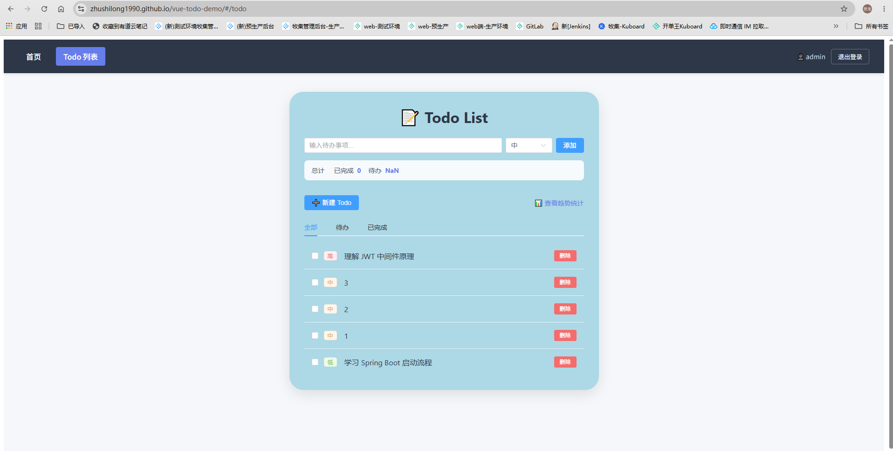
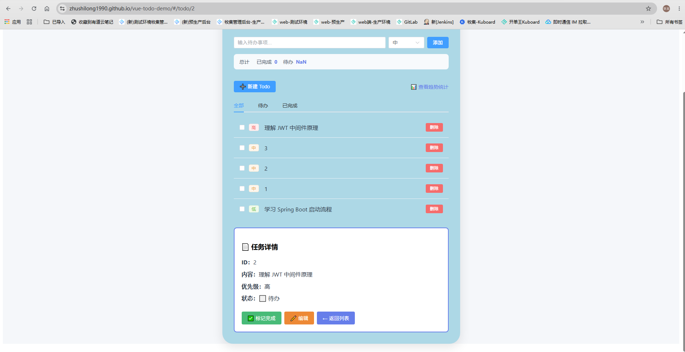
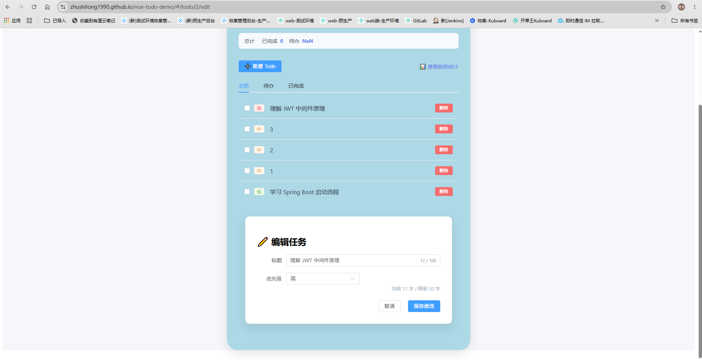
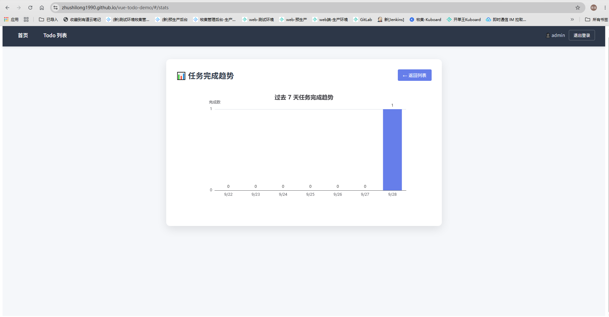

# fullstack-todo-demo

Vue 3 + Spring Boot 全栈 Todo 应用，支持登录注册、增删改查、优先级管理、数据可视化。

**在线体验**：https://zhushilong1990.github.io/vue-todo-demo/
**测试账号**：`admin` / `123456`

---

## 功能演示

### 首页


### Todo 列表（增删改、优先级筛选、分页）


### 任务详情（标记完成、编辑跳转）


### 新建/编辑表单（30 字实时计数、表单校验）


### ECharts 数据可视化（过去 7 天任务完成趋势）


---

## 技术栈

| 层级 | 技术 |
|------|------|
| 前端框架 | Vue 3 (Composition API + `<script setup>`) |
| 构建工具 | Vite |
| UI 组件库 | Element Plus |
| 状态管理 | Pinia |
| 路由 | Vue Router (hash 模式) |
| HTTP 客户端 | Axios + 拦截器 |
| 图表 | ECharts |
| 后端框架 | Spring Boot 2.7.18 |
| 安全 | JWT (jjwt 0.11.5) |
| 数据库 | H2 内存数据库 |
| JDK 版本 | JDK 8 |

---

## 功能列表

- ✅ 用户登录（JWT Token 认证）
- ✅ Todo CRUD（增删改查）
- ✅ 优先级管理（高/中/低）
- ✅ 状态管理（待办/已完成）
- ✅ 按状态筛选 Tab（全部/待办/已完成）
- ✅ 按优先级排序
- ✅ 前端分页
- ✅ ECharts 任务完成趋势图
- ✅ 全局错误处理（401 跳转、网络断开提示、404 页面）
- ✅ 前端表单校验

---

## 系统架构

```
┌─────────────────────────────────────────────────────────────┐
│                         用户浏览器                           │
│    https://zhushilong1990.github.io/vue-todo-demo/          │
│                        (GitHub Pages)                        │
└────────────────────────┬────────────────────────────────────┘
                         │ HTTPS
                         ▼
┌─────────────────────────────────────────────────────────────┐
│                    阿里云 OSS + CDN                          │
│                  siwei7905.cloud (HTTPS)                    │
└────────────────────────┬────────────────────────────────────┘
                         │ HTTPS
                         ▼
┌─────────────────────────────────────────────────────────────┐
│                 腾讯云轻量应用服务器 (Ubuntu)                 │
│                   nginx + Let's Encrypt                     │
│                   Port 443 (HTTPS → HTTP)                   │
│                   Port 8080 (Spring Boot)                   │
└────────────────────────┬────────────────────────────────────┘
                         │ HTTP
                         ▼
┌─────────────────────────────────────────────────────────────┐
│              Spring Boot 2.7.18 (JDK 17)                    │
│                    Port 8080                                 │
│                                                              │
│   ┌──────────┐    ┌──────────────┐    ┌────────────────┐   │
│   │ JwtFilter │───▶│ TodoController│───▶│ TodoService    │   │
│   │ (认证)    │    │ (REST API)    │    │ (业务逻辑)      │   │
│   └──────────┘    └──────────────┘    └────────────────┘   │
│                          │                    │              │
│                          ▼                    ▼              │
│                   ┌──────────────┐    ┌────────────────┐   │
│                   │ H2 内存数据库 │    │ ConcurrentHashMap│   │
│                   │ (存储 Todo)   │    │ (存储 Todo)     │   │
│                   └──────────────┘    └────────────────┘   │
└─────────────────────────────────────────────────────────────┘
```

### JWT 认证流程

```
1. 用户登录 → POST /api/auth/login {username, password}
2. 后端验证 → 返回 JWT Token
3. 前端存 Token 到 localStorage
4. 后续请求 → Axios 请求拦截器自动注入 Authorization: Bearer <token>
5. 后端 JwtFilter 验证 Token → 有效则放行，无效则 401
```

---

## 本地开发

### 前端

```bash
cd vue-counter
npm install
npm run dev
# 访问 http://localhost:5173
```

### 后端

```bash
cd backend
mvn clean package -DskipTests
java -jar target/todo-backend-0.0.1-SNAPSHOT.jar
# 后端运行在 http://localhost:8080
```

---

## 部署说明

| 组件 | 部署方式 |
|------|----------|
| 前端静态资源 | GitHub Pages |
| 反向代理 (HTTPS) | 腾讯云轻量应用服务器 + nginx + Let's Encrypt |
| 后端 API | 腾讯云轻量应用服务器 (Spring Boot jar) |
| 数据库 | H2 内存数据库（无持久化） |

---

## 项目结构

```
fullstack-learning/
├── vue-counter/           # 前端 Vue 3 项目
│   ├── src/
│   │   ├── api/           # Axios 封装 + 拦截器
│   │   ├── components/    # TodoItem / TodoForm / TodoStats 等
│   │   ├── stores/        # Pinia store (todos / auth)
│   │   ├── views/         # 页面组件 (Login / TodoList / TodoDetail / Stats 等)
│   │   └── router/        # Vue Router 配置
│   └── vite.config.js
│
└── backend/               # 后端 Spring Boot 项目
    └── src/main/java/com/example/todobackend/
        ├── controller/    # AuthController / TodoController
        ├── service/       # AuthService / TodoService
        ├── entity/        # User / Todo
        ├── dto/           # ApiResponse / LoginRequest / TodoRequest
        ├── interceptor/   # JwtInterceptor
        ├── config/        # WebMvcConfig / CorsConfig
        ├── util/          # JwtUtil
        └── exception/     # BusinessException / GlobalExceptionHandler
```

---

## API 接口

| 方法 | 路径 | 说明 | 需要认证 |
|------|------|------|----------|
| POST | /api/auth/login | 登录 | 否 |
| GET | /api/todos | 获取所有任务 | 是 |
| GET | /api/todos/{id} | 获取单个任务 | 是 |
| POST | /api/todos | 新建任务 | 是 |
| PUT | /api/todos/{id} | 更新任务 | 是 |
| DELETE | /api/todos/{id} | 删除任务 | 是 |

---

## 学习笔记

本项目是 Vue 3 + Spring Boot 全栈学习过程的产出，覆盖以下知识点：

- Vue 3 Composition API + `<script setup>`
- Pinia 状态管理（响应式、持久化）
- Vue Router（动态路由、嵌套路由、路由守卫）
- Axios 拦截器（Token 注入、错误处理、401 跳转）
- Element Plus 组件（ElButton / ElSelect / ElPagination / ElTabs / ElMessage）
- ECharts 数据可视化
- Spring Boot REST API
- JWT 认证机制
- nginx 反向代理 + HTTPS 配置
